# Hi, I'm Amit Kumar aka Zerograde 👋  
> Data Science • AI • Clean Engineering

<!-- ================= HEADER WAVE ================= -->

  

  
  
  

## 🧠 About Me

Hello — I'm **Amit Kumar**, aka **Zerograde**.  
A **B.Tech CSE (Data Science)** student focused on building **data-driven, production-ready AI systems**.

I don’t just train models —  
I **analyze data → build ML → expose APIs → deploy systems**.

📍 India  
🎓 B.Tech Computer Science (Data Science)  
💼 Open to: **Internships | Entry-level AI / Data roles**

---

## 🧩 Tech Stack & Skills

  
  
  
  
  
  
  
  
  
  
  
  
  

---

## ⭐ Featured Projects

🛒 **ecommerce-recommend**  
ML-based recommendation system for e-commerce personalization.

🛡️ **Insurance**  
Insurance risk & premium prediction using ML models.

🌦️ **weather**  
Weather app using Python + APIs with clean UI.

📊 **Data Analysis Projects**  
EDA, visualization, and insight extraction using Python.

---

## 📊 GitHub Metrics (like lowlighter)

  

  

  

  

---

## 🧠 Contribution Activity (Git History Card)

  

  
  

---

## ⚙️ How I Work

- Break complex problems into **testable components**
- Prefer **data over assumptions**
- Write code meant for **deployment**
- Iterate fast, refactor harder

---

## 📬 Contact

  
  

---

<!-- ================= FOOTER WAVE ================= -->

  

> **“Strong fundamentals. Clean systems. Long-term thinking.”**

